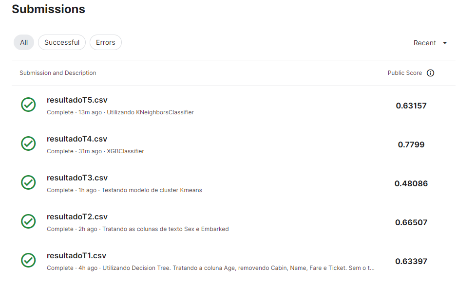

# [Titanic](https://github.com/BrunoFelipeCB/Titanic/blob/main/Titanic.ipynb)
This repository was made to explain the project of **[Kaggle](https://www.kaggle.com/competitions/titanic/overview)**:

**The comments in the codes are in PT-BR**
## Objectives:
- Study to predict who could survive on the Titanic, with a strong focus on data preprocessing.
## Main libraries used:
- Pandas, Numpy, Sklearn, XGBoost and Seaborn.
## You can find me at:
&nbsp;&nbsp;

## [Stages of Code Development](https://github.com/BrunoFelipeCB/Titanic/blob/main/Titanic.ipynb):
- In this first step, I imported the databases and only dealt with empty values.
- In the 'Embarked' column, I got data available on Google, in the 'Age' column I treated the data separating by genders and classes to use the average age of people who were with empty values
- The 'Cabin', 'Name', 'Ticket' and 'Far'e column I chose to exclude from the base because they do not add to the analysis, either because they have a lot of cardinality or because they already have a relationship with Pclass.
- To make this first submission, I used the RandomForest, SVM, and Decision tree models. The best result was with the decision tree. I made the submission and received a **return of 0.6339** 'ResultadoT1'
- In this second step,I processed the text columns, used OneHotEncoder to handle the 'Embarked' column, and a simple lambda function to handle the 'Sex' column.
- I resubmitted with the same 3 models and obtained a **Score of 0.665** 'ResultadoT2'.
- In the third part, I made the submission using another model, the **XGBClassifier**, and obtained a **Score of 0.7799**. Just by changing the model, I increased the result by **11.49%** 'ResultadoT4'
- And in the fourth and last part, I tested the KNN model. With it, I obtained a **Score of 0.6315** 'ResultadoT5', which worsened my model.
## Results and Submission on Kaggle.
- Using techniques such as XGBClassifier, Random Forest, and KNN, The code development involved meticulous data handling, feature engineering, and model selection, resulting in a notable improvement from an initial score of 0.6339 to 0.7799. The iterative process highlighted the impact of model diversification on predictive accuracy for Titanic survival.
  
 
